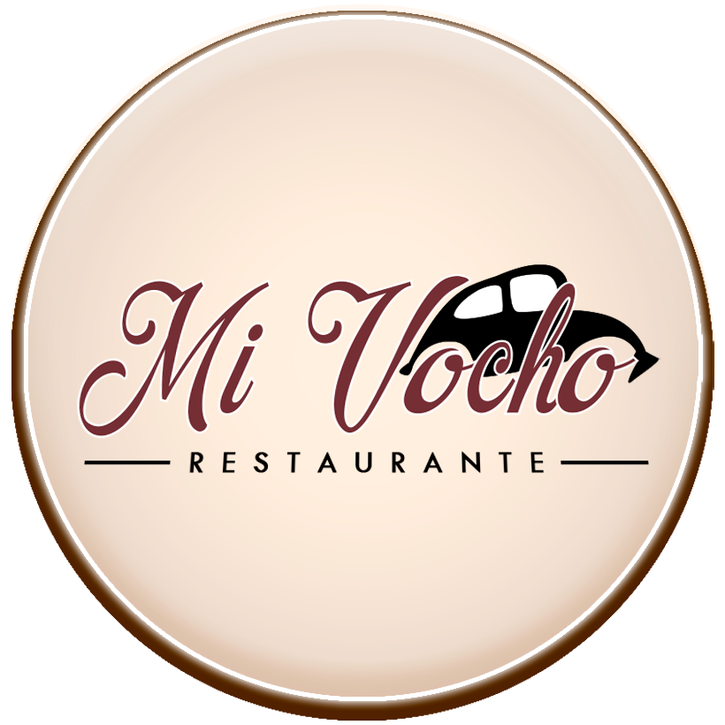
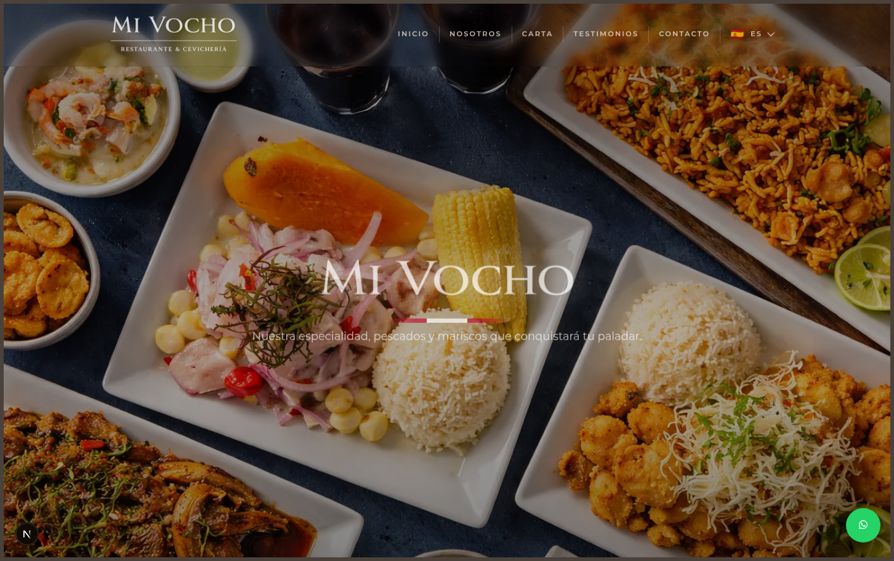

<a id="readme-top"></a>
<!-- SHIELDS -->

<p align='center'> 
  &nbsp;
  &nbsp;
  &nbsp;
  &nbsp;
</p>

<!-- PROJECT LOGO -->
<br>
<div align="center">
   
   <h3 align="center">Mi Vocho</h3>
   <p align="center">
     Landing page de un restaurante de cocina marina peruana — bilingüe, fluida y con identidad propia
     <br>
     <a href="https://github.com/hexed-AAL1X/_MiVocho_"><strong>Explorar la documentación »</strong></a>
     <br>
     <br>
     <a href="https://github.com/hexed-AAL1X/_MiVocho_">Ver demo</a>
     ·
     <a href="https://github.com/hexed-AAL1X/_MiVocho_/issues/new?labels=bug">Reportar bug</a>
     ·
     <a href="https://github.com/hexed-AAL1X/_MiVocho_/issues/new?labels=enhancement">Pedir una mejora</a>
   </p>
</div>

<!-- TABLE OF CONTENTS -->
<details>
  <summary>Tabla de contenidos</summary>
  <ol>
    <li>
      <a href="#sobre-el-proyecto">Sobre el proyecto</a>
      <ul>
        <li>
          <a href="#construido-con">Construido con</a>
        </li>
      </ul>
    </li>
    <li><a href="#avisos-importantes">Avisos importantes</a></li>
    <li>
      <a href="#primeros-pasos">Primeros pasos</a>
      <ul>
        <li><a href="#requisitos">Requisitos</a></li>
        <li><a href="#instalacion">Instalación</a></li>
      </ul>
    </li>
    <li><a href="#contribuir">Contribuir</a></li>
    <li><a href="#contacto">Contacto</a></li>
  </ol>
</details>
<br>

<!-- ABOUT THE PROJECT -->
<a id="sobre-el-proyecto"></a>***Sobre el proyecto***


<div align="center">
  
</div>

**Mi Vocho** es el frontend moderno de un restaurante de cocina marina peruana. El sitio prioriza la atmósfera, el contenido bilingüe (ES/EN), una navegación fluida y un camino claro para reservar — sabores de mar con calidez de casa.

Por qué existe:

* Presentar la marca del restaurante con un primer viewport fuerte: hero, identidad y un CTA claro.
* Mostrar la carta, testimonios, ubicación y reservas por WhatsApp en una composición pulida.
* Mantener un stack ligero (Next.js + React + Tailwind) para que la experiencia sea rápida y fácil de iterar.

Este es el paquete frontend del proyecto Mi Vocho. Esperamos seguir puliendo motion, copy y UX.

<a id="construido-con"></a> 
### Construido con
* &nbsp;
* &nbsp;
* &nbsp;
* &nbsp;
* &nbsp;
<p align="right">(<a href="#readme-top">volver arriba</a>)</p>

<!-- IMPORTANT NOTICES -->
<a id="avisos-importantes"></a>***Avisos importantes***


> [!NOTE]  
> Para instalar y ejecutar **Mi Vocho**, asegúrate de tener lo siguiente:
> 
> | Requisito          | Descripción                                                                                       |
> |--------------------|---------------------------------------------------------------------------------------------------|
> | Runtime            |   |
> | Gestor de paquetes |  |
> | Framework          |               |
 
> [!IMPORTANT]\
> Somos un equipo pequeño comprometido con mejorar Mi Vocho. Espera actualizaciones continuas en rendimiento, visuales y flujo de reservas.
<p align="right">(<a href="#readme-top">volver arriba</a>)</p>

<!-- GETTING STARTED -->
<a id="primeros-pasos"></a>***Primeros pasos***

Estas son instrucciones para configurar el proyecto en local. Para tener una copia funcionando, sigue estos pasos.

<a id="requisitos"></a>
### Requisitos
Lo necesario para usar el software y cómo instalarlo:
* [Node.js](https://nodejs.org/) (se recomienda LTS)
* npm (incluido con Node.js)

<a id="instalacion"></a>
### Instalación
_Ejemplo de cómo instalar y configurar Mi Vocho en tu máquina local._

1. Clona el repositorio
   ```sh
   git clone https://github.com/hexed-AAL1X/_MiVocho_.git
   ```
2. Entra al directorio del proyecto
   ```sh
   cd _MiVocho_
   ```
3. Instala las dependencias
   ```sh
   npm install
   ```
4. Arranca el servidor de desarrollo
   ```sh
   npm run dev
   ```
5. Abre [http://localhost:3000](http://localhost:3000) en el navegador
6. (Opcional) Cambia la URL del remoto de Git para evitar pushes accidentales al proyecto base
   ```sh
   git remote set-url origin https://github.com/tu_usuario/_MiVocho_
   git remote -v # confirmar los cambios
   ```
<p align="right">(<a href="#readme-top">volver arriba</a>)</p>

<!-- CONTRIBUTING -->
<a id="contribuir"></a>***Contribuir***

Las contribuciones hacen de la comunidad open source un lugar increíble para aprender, inspirarse y crear. ¡Cualquier aporte es bienvenido!

Si tienes una sugerencia para mejorar el proyecto, puedes hacer fork del repositorio y abrir un pull request.
¡No olvides darle una estrella al proyecto! Gracias por contribuir.

1. Haz fork del proyecto.
2. Crea una rama para tu mejora (`git checkout -b feature/NuevaMejora`).
3. Haz tus cambios y un commit (`git commit -m 'Add Nueva Mejora'`).
4. Sube los cambios a la rama (`git push origin feature/NuevaMejora`).
5. Abre un pull request.
<p align="right">(<a href="#readme-top">volver arriba</a>)</p>

<!-- CONTACT -->
<a id="contacto"></a>***Contacto***

<p align="center">
  <a href="mailto:hexed_aal1x.ops@proton.me"></a>
  <a href="https://www.instagram.com/hexed_aal1x"></a>
  <a href="https://www.linkedin.com/in/leonardo-bravo-4120b8228/"></a>
</p>
<p align="right">(<a href="#readme-top">volver arriba</a>)</p>
